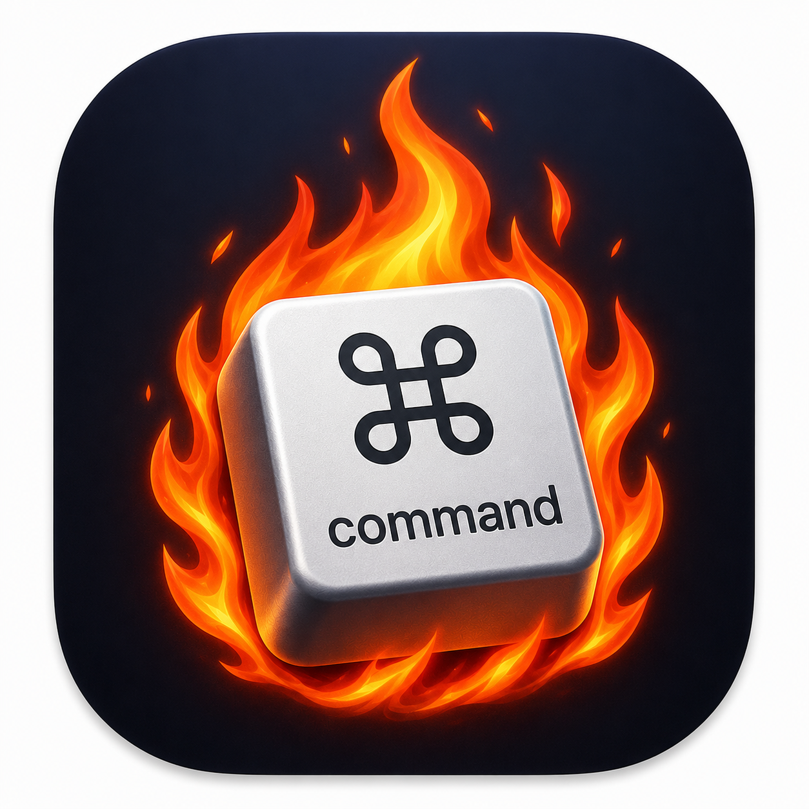

<p align="center">
  
</p>

<h1 align="center">Mac Hotkeys</h1>

<p align="center">
A beautiful native macOS Menu Bar application with the most useful keyboard shortcuts.
</p>

<p align="center">


</p>

---

# ✨ Features

- 🚀 Native macOS Menu Bar App
- ⌨️ 200+ Keyboard Shortcuts
- 🔍 Instant Search
- 📂 Categories
- 🌗 Light / Dark Mode
- 🖱 Beautiful Liquid Glass UI
- ⚡ Fast Native SwiftUI
- 🍎 macOS 26 Design Language

---

# 📸 Screenshots

Coming soon...

---

# 📦 Installation

Download the latest version from the Releases page.

Or clone the repository:

```bash
git clone https://github.com/compilator/mac-hotkeys.git
```

Build:

```bash
./release/build_dmg.sh
```

---

# 🛠 Technologies

- SwiftUI
- AppKit
- NSStatusItem
- NSMenu
- Xcode
- macOS SDK

---

# 🗺 Roadmap

- [x] Native Menu Bar App
- [x] Search
- [x] Categories
- [x] Dark Theme
- [x] About Window
- [x] DMG Packaging
- [ ] Keyboard Shortcut Editor
- [ ] Favorites
- [ ] Auto Updates
- [ ] Localization

---

# 👨‍💻 Author

<p>


</p>

---

# ⭐ Support

If you like this project, please consider giving it a ⭐ on GitHub.

---

<p align="center">
Made with ❤️ in SwiftUI
</p>
